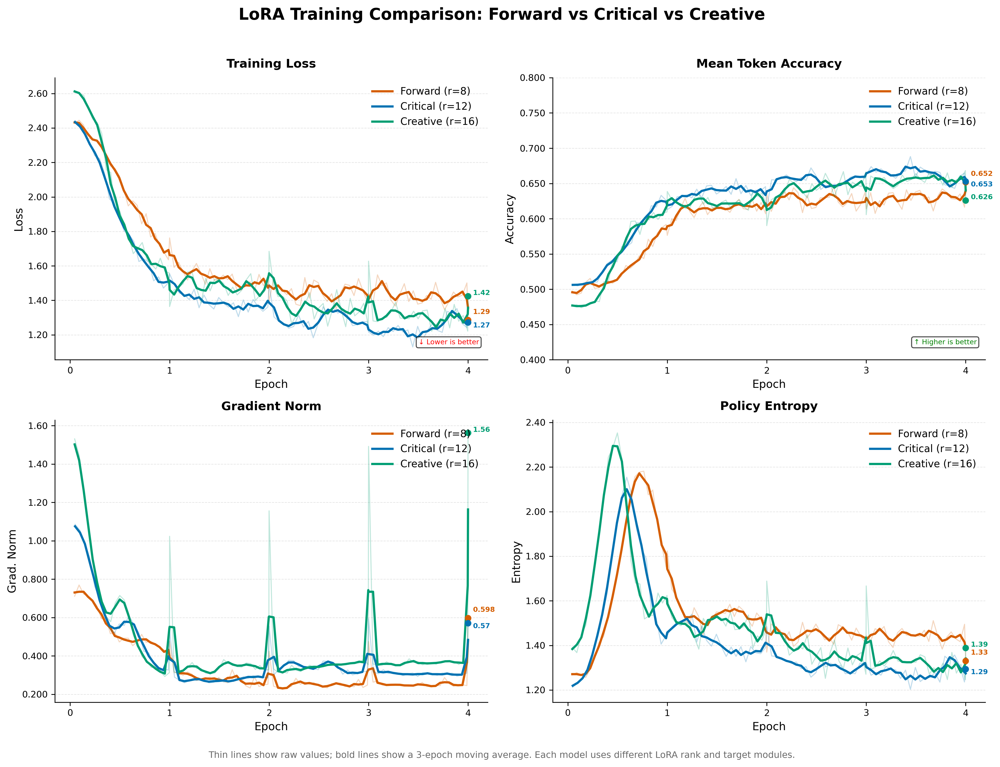

# CognitiveProbe

基于 LoRA 认知注入的 Multi-Agent 协作推理系统。

通过三个具有不同认知风格（前瞻、批判、创造）的 Agent 协作分析问题，经**辩论-共识协议**互相质疑和修正，由 **Coordinator 智能路由**分发任务，最终由 **Aggregator** 综合生成高质量回答。每个 Agent 使用独立的 **QLoRA adapter** 进行认知风格微调。

---

## 系统架构

```
用户提问
    │
    ▼
┌─────────────────────────────────────────┐
│           Coordinator Agent             │
│     判断问题类型，决定调用哪些 Agent      │
└────────────────┬────────────────────────┘
                 │
    ┌────────────┼────────────┐
    │            │            │
    ▼            ▼            ▼
 简单问候    简单事实问题    复杂推理问题
 (直接回答)  (1个Agent)    (3个Agent并行)
    │            │            │
    │            ▼            ▼
    │     ┌──────────┐  ┌─────────────────────┐
    │     │ 批判 Agent│  │ 前瞻/批判/创造 Agent │
    │     └────┬─────┘  │   三个并行执行       │
    │          │        └────────┬────────────┘
    │          │                 │
    │          │                 ▼
    │          │        ┌─────────────────┐
    │          │        │  sync_point     │
    │          │        │  汇聚等待        │
    │          │        └────────┬────────┘
    │          │                 │
    │          │                 ▼
    │          │        ┌─────────────────┐
    │          │        │ debate_reviewer  │
    │          │        │ 批判审查其他分析  │
    │          │        └────────┬────────┘
    │          │                 │
    │          │                 ▼
    │          │     ┌───────────────────────┐
    │          │     │ forward_reviser       │
    │          │     │ creative_reviser      │
    │          │     │ 两个并行修正          │
    │          │     └───────────┬───────────┘
    │          │                 │
    │          │                 ▼
    │          │        ┌─────────────────┐
    │          │        │  sync_point_2   │
    │          │        └────────┬────────┘
    │          │                 │
    ▼          ▼                 ▼
┌─────────────────────────────────────────┐
│            汇总 Agent                    │
│   综合所有分析，提取共识与分歧，写总结    │
└─────────────────────────────────────────┘
                 │
                 ▼
            最终回答
```

### 三个 Agent 的认知分工

| Agent | 认知风格 | LoRA 秩 | 训练状态 | 分析角度 |
|-------|---------|---------|---------|---------|
| 前瞻 Agent | Forward-looking | r=8 | ✅ 已完成 | 短期→中期→长期因果链推演 |
| 批判 Agent | Critical | r=12 | ✅ 已完成 | 逻辑漏洞、反例、谬误识别 |
| 创造 Agent | Creative | r=16 | ✅ 已完成 | 跨领域类比，创新视角 |

### Coordinator 路由逻辑

| 问题类型 | 示例 | 路由路径 | 模型调用次数 |
|---------|------|---------|------------|
| 简单问候 | "你好"、"你是谁" | 直接回答 | 2 次 |
| 简单事实 | "Python是什么" | 批判→汇总 | 3 次 |
| 复杂推理 | "太阳消失了会怎样" | 3 Agent 并行→辩论→修正→汇总 | 8 次 |

### 辩论-共识协议

```
Round 1: 三个 Agent 各自分析（并行）
    ↓
Round 2: 批判 Agent 审视前瞻和创造的分析，提出质疑
    ↓
Round 3: 前瞻和创造 Agent 根据质疑修正自己的观点（并行）
    ↓
最终: 综合修正后的分析，生成总结
```

---

## 技术栈

| 组件 | 技术 | 用途 |
|------|------|------|
| API 框架 | FastAPI | REST API 接口 |
| Agent 编排 | LangGraph | 多 Agent 工作流状态图 |
| 基座模型 | Qwen3-4B（本地 HF 格式） | 本地 LLM 推理引擎 |
| 训练框架 | PEFT + QLoRA + SFTTrainer | LoRA 认知注入训练 |
| 量化 | bitsandbytes (4-bit NF4) | 省显存，适配消费级显卡 |
| 数据库 | PostgreSQL 16 | 任务持久化存储 |
| 缓存 | Redis 7 | 缓存（待集成） |
| ORM | SQLAlchemy | 数据库操作 |
| 容器化 | Docker Compose | 服务编排 |

---

## 项目结构

```
Multi-Agent/
├── configs/
│   └── config.yaml                  # 全局配置（模型、数据库、LoRA 参数）
├── src/
│   ├── api/                         # 路由层
│   │   ├── health.py                # 健康检查
│   │   ├── config_route.py          # 配置查看
│   │   ├── test_llm.py              # LLM 调用测试
│   │   ├── tasks.py                 # 任务 CRUD + 端到端问答
│   │   └── agents.py                # 多 Agent 推理接口
│   ├── agents/                      # Agent 层
│   │   ├── graph.py                 # LangGraph 工作流定义
│   │   └── lora_inference.py        # 本地模型推理模块
│   ├── models/                      # 数据层
│   │   ├── task.py                  # Task 表模型
│   │   ├── database.py              # 数据库连接
│   │   └── crud.py                  # 增删改查
│   ├── config.py                    # 配置加载器
│   └── main.py                      # 应用入口（启动时预加载模型）
├── data/                            # LoRA 训练数据
│   ├── forward_train.json           # 前瞻推理（500条）
│   ├── critical_train.json          # 批判推理（500条）
│   └── creative_train.json          # 创造推理（500条）
├── models/                          # 基座模型（Qwen3-4B，不提交 Git）
├── adapters/                        # 已训练的 LoRA adapter
│   ├── forward_lora/                # Forward Agent（r=8, 5.9M 参数）
│   ├── critical_lora/               # Critical Agent（r=12, 19.5M 参数）
│   ├── creative_lora/               # Creative Agent（r=16, 33.0M 参数）
│   ├── training_comparison.png      # 三模型对比图
│   └── training_comparison.pdf
├── scripts/                         # 训练 & 工具脚本
│   ├── train_forward.py             # Forward LoRA 训练
│   ├── train_critical.py            # Critical LoRA 训练
│   ├── train_creative.py            # Creative LoRA 训练
│   ├── test_lora.py                 # LoRA 推理验证
│   ├── plot_forward.py              # Forward 训练指标可视化
│   ├── plot_critical.py             # Critical 训练指标可视化
│   ├── plot_creative.py             # Creative 训练指标可视化
│   ├── plot_compare.py              # 三模型横向对比
│   └── debug_uvicorn.py             # 最小复现调试脚本
├── learning/                        # 学习笔记
│   ├── project-setup-notes.md       # 项目搭建笔记（28 章节）
│   └── error-notes.md               # 错误记录
├── docker-compose.yml               # PostgreSQL + Redis
├── requirements.txt                 # Python 依赖
└── README.md
```

---

## API 接口

| 方法 | 路径 | 功能 | 说明 |
|------|------|------|------|
| GET | `/health` | 健康检查 | 返回 `{"status": "ok"}` |
| GET | `/config` | 查看配置 | 返回 config.yaml 内容 |
| GET | `/test_llm` | LLM 测试 | 测试模型连接 |
| POST | `/tasks` | 创建任务 | 参数：question |
| GET | `/tasks/{id}` | 查询任务 | 返回任务详情 |
| PUT | `/tasks/{id}` | 修改任务 | 参数：question |
| DELETE | `/tasks/{id}` | 删除任务 | 删除指定任务 |
| POST | `/ask` | 端到端问答 | 提问→模型回答→存库 |
| POST | `/reason` | 多 Agent 推理 | Coordinator 路由→辩论→修正→综合 |

### /reason 返回示例

```json
{
  "question": "如果中国全面推行四天工作制，会带来什么影响？",
  "question_type": "complex_reasoning",
  "forward": "<reasoning>\n步骤1：短期影响（1-3年）...\n步骤2：中期影响（4-10年）...\n</reasoning>\n最终分析：...",
  "critical": "问题中'普遍'一词过度泛化...",
  "creative": "学制延长如同生态修复期...",
  "debate_critique": "前瞻分析中关于生产率的假设缺乏数据支撑...",
  "forward_revised": "修正后的前瞻分析：考虑到批判指出的证据不足问题...",
  "creative_revised": "修正后的创造分析：保留类比但修正了不合理的推断...",
  "final": "综合三个视角：四天工作制应分行业渐进推行..."
}
```

---

## 快速开始

### 环境要求

- Python 3.10+
- Docker Desktop（PostgreSQL + Redis）
- GPU（RTX 3060 6GB+，用于本地模型推理和 LoRA 训练）
- 系统内存 >= 16GB（加载模型需要 ~4GB 可用内存）

### 启动步骤

```bash
# 1. 创建虚拟环境
python -m venv .venv
.venv\Scripts\activate          # Windows

# 2. 安装依赖
pip install -r requirements.txt

# 3. 启动数据库服务
docker compose up -d

# 4. 启动 API 服务（启动时会自动加载模型，约 16 秒）
uvicorn src.main:app --host 127.0.0.1 --port 8000

# 5. 访问 API 文档
# http://127.0.0.1:8000/docs
```

**启动时控制台输出：**
```
==========================================================
预加载本地模型（主线程）...
==========================================================
[LoRA推理] 启动预加载...
[LoRA推理] 加载基座模型（4-bit）...
[LoRA推理] 加载 forward LoRA adapter...
[LoRA推理] 加载 critical LoRA adapter...
[LoRA推理] 加载 creative LoRA adapter...
[LoRA推理] 预加载完成，所有 adapter 就绪
INFO:     Uvicorn running on http://127.0.0.1:8000
```

---

## 训练 LoRA Adapter

### 训练流程

```
Step 1: 准备训练数据（data/xxx_train.json，500条）
Step 2: 编辑 config.yaml 中的 LoRA 参数
Step 3: 运行训练脚本
Step 4: 验证 adapter 效果
Step 5: 集成到 graph.py
```

### 运行训练

```bash
# 训练 Forward Agent LoRA
python scripts/train_forward.py

# 训练 Critical Agent LoRA
python scripts/train_critical.py

# 训练 Creative Agent LoRA
python scripts/train_creative.py

# 验证训练效果
python scripts/test_lora.py

# 可视化训练指标
python scripts/plot_forward.py
python scripts/plot_critical.py
python scripts/plot_creative.py

# 三模型横向对比
python scripts/plot_compare.py
```

### 训练结果对比

| Agent | Loss 初始 | Loss 最终 | Loss 降幅 | Accuracy 初始 | Accuracy 最终 | Accuracy 升幅 | 可训练参数 |
|-------|----------|----------|----------|--------------|--------------|--------------|-----------|
| Forward | 2.55 | 1.47 | ↓42.3% | 47.8% | 58.5% | ↑10.8% | 5,898,240 (0.15%) |
| Critical | 2.44 | 1.09 | ↓55.5% | 50.1% | 68.8% | ↑18.7% | 19,464,192 (0.49%) |
| Creative | 2.69 | 0.96 | ↓64.5% | 47.3% | 71.7% | ↑24.4% | 33,030,144 (0.83%) |

训练详情见 [learning/project-setup-notes.md](learning/project-setup-notes.md) 第二十三节。

---

## 训练结果分析

### 1. 总体结论

三个 LoRA Agent 的训练均成功完成，且呈现明显的**性能梯度**：

```
Forward (r=8, 5.9M)  →  Critical (r=12, 19.5M)  →  Creative (r=16, 33.0M)
     ↓42.3%                    ↓55.5%                    ↓64.5%
    ↑10.8%                    ↑18.7%                    ↑24.4%
```

**核心发现：可训练参数量与训练效果呈正相关。** Creative 的可训练参数是 Forward 的 5.6 倍，Loss 降幅也是 Forward 的 1.5 倍。

### 2. 训练效率分析

| Agent | 收敛 Epoch | 最终 Loss | 最终 Accuracy | 训练效率评价 |
|-------|-----------|----------|--------------|-------------|
| Forward | Epoch 1.0 | 1.47 | 58.5% | 快速收敛但效果有限 |
| Critical | Epoch 2.1 | 1.09 | 68.8% | 中速收敛，效果良好 |
| Creative | Epoch 3.1 | 0.96 | 71.7% | 慢速收敛但效果最佳 |

**Forward 收敛最快但效果最差**，因为参数太少（5.9M），模型容量有限，很快就能学完能学的东西。

**Creative 收敛最慢但效果最好**，因为参数最多（33.0M），模型容量大，需要更多迭代才能充分学习，但最终能达到更高的性能。

### 3. 参数量与性能关系

| Agent | 可训练参数 | 占模型比例 | Loss 降幅 | Accuracy 升幅 | 参数效率 |
|-------|-----------|-----------|----------|--------------|---------|
| Forward | 5.9M | 0.15% | 42.3% | 10.8% | 7.2%/M |
| Critical | 19.5M | 0.49% | 55.5% | 18.7% | 2.8%/M |
| Creative | 33.0M | 0.83% | 64.5% | 24.4% | 1.9%/M |

**参数效率递减**：Forward 每百万参数带来 7.2% 的 Loss 降幅，而 Creative 只有 1.9%/M。这符合机器学习的**边际收益递减规律**——参数越多，每增加一单位参数带来的收益越小。

### 4. LoRA 注入层分析

| Agent | Target Modules | MLP 层数 | 效果 | 分析 |
|-------|---------------|---------|------|------|
| Forward | q,k,v,o | 0 | 最差 | 只注入注意力层，影响"看哪里" |
| Critical | q,k,v,o,gate,up | 2 | 中等 | 注入 2 个 MLP 层，影响"想什么" |
| Creative | q,k,v,o,gate,up,down | 3 | 最好 | 注入 3 个 MLP 层，全面影响推理 |

**关键发现：MLP 层注入是性能提升的关键。**

- 注意力层（q,k,v,o）：控制模型"看哪里"，维度 2560×2560
- MLP 层（gate,up,down）：控制模型"想什么"，维度 2560×9728（大 3.8 倍）

Forward 只注入注意力层（6.5M 参数/层），而 Critical 和 Creative 额外注入了 MLP 层（24.9M 参数/层），这就是性能差距的主要原因。

### 5. 训练稳定性

| Agent | Grad Norm 范围 | 稳定性 | 说明 |
|-------|---------------|--------|------|
| Forward | 0.24 ~ 0.77 | ✅ 稳定 | 最稳定，参数最少 |
| Critical | 0.29 ~ 1.09 | ✅ 稳定 | 稳定，有轻微波动 |
| Creative | 0.28 ~ 1.48 | ✅ 稳定 | 波动最大，但仍在健康范围 |

三个模型的 Grad Norm 都在健康范围内（< 2.0），没有梯度爆炸或消失。Creative 的波动最大，因为参数最多、学习能力最强，优化过程更复杂。

### 6. 训练图像说明

#### 图 1：Forward LoRA 训练指标


*图 1：Forward Agent LoRA 训练过程中的四项核心指标变化。左上图为训练损失（Training Loss），从 2.55 下降至 1.47，降幅 42.3%，表明模型在学习前瞻推理模式；右上图为梯度范数（Gradient Norm），稳定在 0.24-0.77 范围内，无梯度爆炸现象；左下图为策略熵（Policy Entropy），先升后降，反映模型从不确定到确定的学习过程；右下图为平均 Token 准确率（Mean Token Accuracy），从 47.8% 提升至 58.5%，提升 10.8 个百分点。整体训练过程平稳，但受限于较小的参数量（5.9M），性能提升有限。*

#### 图 2：Critical LoRA 训练指标


*图 2：Critical Agent LoRA 训练过程中的四项核心指标变化。左上图训练损失从 2.44 下降至 1.09，降幅 55.5%，明显优于 Forward；右上图梯度范数在 0.29-1.09 范围内波动，训练稳定；左下图策略熵从 1.27 升至峰值 2.27 后回落至 1.13，显示模型经历了充分的探索阶段；右下图准确率从 50.1% 提升至 68.8%，提升 18.7 个百分点。Critical 注入了 6 个目标模块（含 gate_proj 和 up_proj），可训练参数达 19.5M，是 Forward 的 3.3 倍，因此学习能力更强。*

#### 图 3：Creative LoRA 训练指标


*图 3：Creative Agent LoRA 训练过程中的四项核心指标变化。左上图训练损失从 2.69 下降至 0.96，降幅 64.5%，为三个模型中最佳；右上图梯度范数在 0.28-1.48 范围内波动，虽有波动但整体稳定；左下图策略熵从 1.44 升至 2.29 后回落至 1.05，探索充分；右下图准确率从 47.3% 提升至 71.7%，提升 24.4 个百分点，为三个模型中最高。Creative 注入了全部 7 个目标模块（含 down_proj），可训练参数达 33.0M，是 Forward 的 5.6 倍，因此能达到最佳性能。*

#### 图 4：三个 Agent 训练结果横向对比



*图 4：三个 LoRA Agent 训练结果的横向对比。橙色线为 Forward（r=8），蓝色线为 Critical（r=12），绿色线为 Creative（r=16）。左上图显示训练损失对比，Creative 的最终损失（0.96）明显低于 Critical（1.09）和 Forward（1.47）；右上图显示准确率对比，Creative 的最终准确率（71.7%）高于 Critical（68.8%）和 Forward（58.5%）；左下图显示梯度范数对比，三者均在健康范围内；右下图显示策略熵对比，Creative 的最终熵最低（1.05），表明模型最为确定。该图清晰展示了"参数量越大，训练效果越好"的正相关关系。*

### 7. 技术洞察

#### 7.1 为什么参数越多效果越好？

LoRA 的核心思想是在冻结的基座模型旁边挂载小矩阵，通过训练这些小矩阵来调整模型行为。参数越多，模型的**表达能力**越强，能学到更复杂的模式。

```
Forward (5.9M):   只能学到基本的前瞻推理模式
Critical (19.5M): 能学到更复杂的批判性思维模式
Creative (33.0M): 能学到最复杂的跨领域类比模式
```

#### 7.2 为什么 MLP 层比注意力层更重要？

在 Transformer 架构中：
- **注意力层**：负责"看哪里"，决定信息的权重分配
- **MLP 层**：负责"想什么"，存储和处理知识

对于认知风格注入任务，我们需要改变的是模型"怎么想"，而不是"看哪里"。因此，注入 MLP 层（gate_proj, up_proj, down_proj）比只注入注意力层更有效。

#### 7.3 边际收益递减

| 参数增量 | Loss 降幅增量 | 边际收益 |
|---------|--------------|---------|
| Forward → Critical (+13.6M) | +13.2% | 0.97%/M |
| Critical → Creative (+13.5M) | +9.0% | 0.67%/M |

从 Critical 到 Creative 的参数增量与 Forward 到 Critical 几乎相同（~13.5M），但收益从 13.2% 降到 9.0%。这说明**参数投入的边际收益在递减**。

### 8. 实际应用建议

1. **如果显存有限（6GB）**：使用 Forward（5.9M），效果一般但最省资源
2. **如果追求性价比**：使用 Critical（19.5M），效果良好，参数适中
3. **如果追求最佳效果**：使用 Creative（33.0M），效果最好但需要更多资源

### 9. 后续优化方向

1. **增加训练数据**：当前每个 Agent 只有 500 条数据，增加到 1000-2000 条可能进一步提升效果
2. **添加验证集**：当前全量训练，无法检测过拟合，建议留出 10% 作为验证集
3. **调整 instruction**：当前 instruction 较弱，强化 instruction 可能让 LoRA 学到更独特的认知风格
4. **尝试更大的 rank**：如果显存允许，可以尝试 r=24 或 r=32，进一步提升表达能力

---

## 工作原理

### 模型调用架构

系统使用**本地 HuggingFace Qwen3-4B + LoRA adapter**替代 Ollama API，实现"一模型多风格"：

```
call_llm(prompt)
    ├─ use_lora="forward"   → base_model + forward LoRA   → forward_agent, forward_reviser
    ├─ use_lora="critical"  → base_model + critical LoRA  → critical_agent
    ├─ use_lora="creative"  → base_model + creative LoRA  → creative_agent, creative_reviser
    └─ use_lora=None        → base_model（无 LoRA）        → coordinator, debate_reviewer, aggregator
```

**设计要点：**
- 基座模型只加载一次（全局单例）
- LoRA adapter 懒加载，底层权重共享（不额外占显存）
- 总显存占用约 4GB（适配 RTX 3060 6GB）
- 模型在 FastAPI 创建前的主线程中加载（避免 CUDA 死锁）

### LangGraph 状态图

- **State**：共享数据包，在节点之间流动
- **Node**：处理函数，读取 state → 处理 → 返回部分更新
- **Edge**：节点之间的连接，支持条件路由
- **Send**：并行分发，同时启动多个节点
- **sync_point**：汇聚节点，等待所有并行任务完成

### State 数据结构

```python
class AgentState(TypedDict):
    question: str              # 用户的问题
    question_type: str         # coordinator 判断的类型
    forward_answer: str        # 前瞻 Agent 的分析
    critical_answer: str       # 批判 Agent 的分析
    creative_answer: str       # 创造 Agent 的分析
    debate_critique: str       # 辩论质疑
    forward_revised: str       # 修正后的前瞻分析
    creative_revised: str      # 修正后的创造分析
    final_answer: str          # 最终综合总结
```

### 完整调用链

```
POST /reason?question=xxx
    │
    ▼
agents.py（接收请求）
    │
    ▼
graph.py（LangGraph 工作流）
    │
    ├─ coordinator：分类问题
    ├─ dispatcher：Send 并行分发
    ├─ 3 个 Agent 并行执行（各自使用对应 LoRA）
    ├─ sync_point：汇聚等待
    ├─ debate_reviewer：批判审查
    ├─ 2 个 reviser 并行修正
    ├─ sync_point_2：汇聚等待
    ├─ aggregator：综合总结
    │
    ▼
返回 JSON（含辩论中间结果）
```

---

## 开发状态

### 已完成

- [x] 项目骨架与配置管理
- [x] FastAPI 应用 + 路由拆分
- [x] Docker Compose（PostgreSQL + Redis）
- [x] SQLAlchemy ORM（Task 表 CRUD）
- [x] 端到端问答接口（/ask）
- [x] LangGraph 多 Agent 工作流
- [x] Coordinator 智能路由
- [x] 3 个认知 Agent（前瞻/批判/创造）
- [x] Send API 并行执行 + sync_point 汇聚
- [x] 辩论-共识协议（批判审查→并行修正）
- [x] Aggregator 综合总结
- [x] 异常处理（所有 Agent 节点 try-except 容错）
- [x] 训练数据准备（1500条，每种风格500条）
- [x] **Forward Agent QLoRA 训练**（loss↓42%, accuracy↑11%）
- [x] **Critical Agent QLoRA 训练**（loss↓56%, accuracy↑19%）
- [x] **Creative Agent QLoRA 训练**（loss↓65%, accuracy↑24%）
- [x] **LoRA adapter 集成到 LangGraph**（本地模型替代 Ollama）
- [x] **lora_inference.py 推理模块**（一模型多风格，~4GB 显存）
- [x] LoRA 推理验证脚本（test_lora.py）
- [x] 训练指标可视化（单模型 + 三模型对比）
- [x] 完整学习笔记（project-setup-notes.md，28 章节）

### 待开发

- [ ] Milvus 向量检索集成
- [ ] Langfuse 可观测性
- [ ] 评估框架（LogiQA 2.0）
- [ ] Streamlit 前端界面
- [ ] 三角互评（critical 也被质疑）

---

## 踩坑记录（关键教训）

| 坑 | 现象 | 根因 | 解决 |
|----|------|------|------|
| CUDA 线程安全 | 请求中加载模型卡死 | PyTorch CUDA 上下文只能在主线程初始化 | 启动时主线程预加载 |
| Ollama 残留 | ollama stop 后仍无法加载 | 进程未退出，占用 CUDA 上下文 | `taskkill /F /IM ollama.exe` |
| 内存不足 | 加载 41% 崩溃 | 单个分片 3.8GB > 可用内存 3.1GB | 关 Chrome/Docker，确保 >4GB 可用 |
| bf16 不支持 | `CUBLAS_STATUS_EXECUTION_FAILED` | RTX 3060 不支持 bf16 | 改用 `torch.float16` |
| 4-bit + fp16 冲突 | `_amp_foreach...` 错误 | 量化训练内部已处理精度 | 删除 TrainingArguments 中的 fp16 |
| Docker 不启动 | 数据库 Connection refused | 容器重启后默认不自动启动 | `docker start cognitive_postgres` |
| pad_token 缺失 | 训练格式错误 | Qwen3 默认没有 pad_token | `tokenizer.pad_token = tokenizer.eos_token` |
| SFTTrainer 参数名 | unexpected keyword argument | trl 1.6.0 改名为 processing_class | 使用 `processing_class=tokenizer` |

---

## License

MIT
